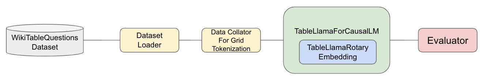
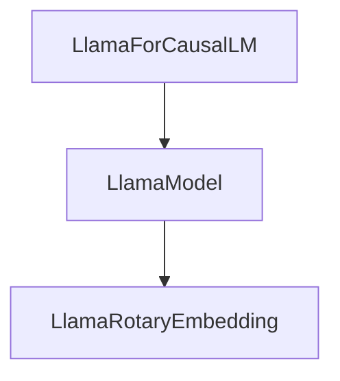

# 2D-Aware LLMs: Improving Table Question Answering with 2D Positional Encoding

## Table of Contents

- [Introduction](#introduction)
- [Installation](#installation)
- [Dataset](#dataset)
- [Modeling](#modeling)
- [Usage](#usage)
- [Contact](#contact)

## Introduction



*Figure 1: Overview of the model pipeline.*

We introduced a new approach to positional encoding by integrating vertical positional information using a 2D Positional Encoding (2DPE) framework. This enhancement is designed to improve large language models' (LLMs) ability to develop two-dimensional positional awareness, enabling them to better handle structured data and complex document formats. Our experiments involved incorporating the 2DPE mechanism into the Rotary Positional Embedding (RoPE) layer of the 1B and 3B parameter versions of the Llama 3.2 Instruction models. These experiments highlight both the limitations and the potential of this method in improving LLMs' vertical positional awareness. 

## Installation

For the following instructions, `mamba` and `conda` are interchangeable. **`mamba` is recommended.**

### First-Time Setup

1. **Create the environment:**

    ```bash
    mamba env create -f environment.yaml
    ```

2. **Activate the environment:**

    ```bash
    mamba activate cs230
    ```

    To deactivate the environment, run:

    ```bash
    mamba deactivate
    ```

3. **Create a `.env` file:**

    - Use `.env.example` as a template.
    - Add your environment variables to the new `.env` file.

### Installing New Packages

1. **Add the package to `environment.yaml`** and run:

    ```bash
    mamba env update -f environment.yaml
    ```

    - If you use `pip` to install packages, add them to the `pip` section in `environment.yaml`.
    - **Do not install new packages directly through `conda`, `mamba`, or `pip`.**

## Dataset

### Overview

We utilized the [WikiTableQuestions dataset](https://github.com/ppasupat/WikiTableQuestions.git) for our experiments. We performed preprocessing and filtering on the original dataset to tailor it to our needs.

- **Training Set:** 14,149 samples
- **Evaluation Set:** 3,515 samples
- **Test Set:** 4,344 samples

### Dataset File Structure

- **`csv/`**  
  Contains all context tables for question answering in `.csv` format. We have also included the `.html` and `.table` formats for additional flexibility.

- **`data/`**
  - `train.csv`
  - `eval.csv`
  - `test.csv`
  
  Each `*.csv` file contains all the questions along with their corresponding context and answers. The structure of these files is as follows:

  - **Columns:**
    - `question` (*str*): The text of the question.
    - `answer` (*str*): The answer to the question.
    - `context` (*str*): The name of the table associated with the question.
    - `id` (*str*): A unique identifier for each entry.
    - `task` (*enum, optional*): Specifies the type of task; either `"arithmetic"` or `"list-item"`.
    - `direction` (*enum, optional*): Indicates the orientation; either `"row"` or `"col"`.
    - `table_row_num` (*int, optional*): The number of rows in the table.
    - `table_width` (*int, optional*): The number of columns in the table.

### Downloading the Dataset

You can obtain the dataset by downloading it directly from the source:

- **Direct Download:** [Download Link](https://drive.google.com/file/d/1pCd0RpDdYDEOj9sUWZT6er5B8xb6JkHa/view?usp=sharing)

### Dataset Processing

- **Utils: `DatasetsLoader`**  
  This utility method is used to load the dataset from the CSV files.

- **Data Class: `DataCollatorForGridTokenization`**  
  After loading the dataset, we use this class to perform grid tokenization and collate the data into batches. This process is essential for preparing the data in a format suitable for training our models.

## Modeling

In this section, we illustrate the architecture of our model, highlighting how the 2D Positional Encoding (2DPE) is integrated into the RoPE layer of the Llama 3.2 models.

### Modules Hierarchy

Below is the hierarchy of modules in the Llama 3.2 model:



Based on the above hierarchy, we created a few new classes to integrate the 2DPE mechanism effectively.

### `TableLlamaConfig`
  We introduced a custom configuration class, TableLlamaConfig, which inherits from LlamaConfig. This class adds a new parameter rope_table_llama to specify the settings for our 2DPE mechanism. It allows customization of the 2D positional encoding parameters, such as line length and channel indices for the x (horizontal) and y (vertical) dimensions.

```python
class TableLlamaConfig(LlamaConfig):
    def __init__(self, **kwargs):
        super().__init__(**kwargs)
        rope_table_llama = kwargs.pop("rope_table_llama", None)
        if rope_table_llama is None:
            self.rope_table_llama = {
                "line_length": None,
                "x_channels_start": None,
                "x_channels_end": None,
                "x_channels_step": None,
                "y_channels_start": None,
                "y_channels_end": None,
                "y_channels_step": None,
            }
        else:
            self.rope_table_llama = rope_table_llama
```

### `TableLlamaRotaryEmbedding`
We created a new class, TableLlamaRotaryEmbedding, that extends the standard rotary positional embedding to include vertical positional information. By modifying the position IDs and frequencies, the model can now encode both horizontal and vertical positions.

```python
class TableLlamaRotaryEmbedding(torch.nn.Module):
    def __init__(self, config: TableLlamaConfig, device=None):
        super().__init__()
        # Initialization code...

    @torch.no_grad()
    def forward(self, x, position_ids):
        # Compute x and y position IDs
        # Apply rotary embeddings for both dimensions
        return cos.to(dtype=x.dtype), sin.to(dtype=x.dtype)
```

- **Key Features:**
  - 2D Position IDs: Separates position IDs into x and y components based on the token positions in the sequence.
  - Frequency Adjustments: Adjusts inverse frequencies to account for two-dimensional positions.
  - Rotary Embedding Application: Applies rotary embeddings to both x and y positions, enhancing the model's spatial understanding.

### `TableLlamaModel`
We created TableLlamaModel by extending LlamaModel and integrating our custom rotary embedding.

``` python
class TableLlamaModel(LlamaModel):
    def __init__(self, config):
        super().__init__(config)
        self.rotary_emb = TableLlamaRotaryEmbedding(config)
```

### `TableLlamaForCausalLM`
Similarly, we extended LlamaForCausalLM to create TableLlamaForCausalLM, which uses our customized model.

```python
class TableLlamaForCausalLM(LlamaForCausalLM):
    def __init__(self, config: TableLlamaConfig):
        super().__init__(config)
        self.model = TableLlamaModel(config)
```

## Usage

The `run_*.sh` scripts are used to train and evaluate the TableLlama model with the desired configurations. Make sure you have set up the environment and dependencies as described in the [Installation](#installation) section before running the scripts.

### Running the Training
First, check the scripts/train_config.yaml file to make sure the configurations are correct.

To start training, run:

```bash
bash run_train.sh
```

### Running the Evaluation
First, check the `scripts/eval_config.yaml` file to make sure the configurations are correct.

To start evaluation, run:

```bash
bash run_eval.sh
```

### Training Environment
The `scripts/*_config.yaml` files contain the configurations for training and evaluation scripts.
The scripts are set up to be run on AWS G6e instances, equipped with an Nvidia L40S GPU with 48 GB of memory.

#### Environment Activation
Make sure to activate the correct environment before running the script:

```bash
mamba activate cs230
```

#### Training Logs
The training logs will be saved in the `outputs/` directory by default. You can monitor the progress there. 

## Contact
For any questions or feedback, feel free to contact us:

Email: 
yuchihsu@stanford.edu,
jziyi@stanford.edu,
yejuahn@stanford.edu